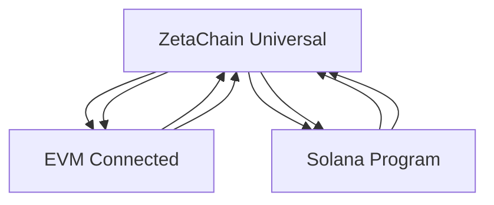

# Universal NFT Cross-Chain Implementation - Complete Guide

## Overview

This repository provides a complete implementation of ZetaChain's Universal NFT standard with full cross-chain support between ZetaChain, EVM-compatible chains, and Solana. The implementation enables seamless NFT transfers while maintaining persistent token IDs and metadata consistency across all supported networks.

## 🏗️ Architecture

### Core Components

1. **Universal Contract (ZetaChain)** - Hub for all cross-chain operations
2. **Connected Contracts (EVM)** - Chain-specific NFT implementations  
3. **Solana Program (Rust/Anchor)** - Metaplex-based NFT handling with cross-chain support
4. **Gateway Wiring** - Message encoding/decoding between chains
5. **TypeScript SDK** - Unified interface for all operations
6. **Demo dApp** - Next.js application showcasing the functionality

### Cross-Chain Flow



## 🚀 Quick Start

### Prerequisites

- **Node.js** >= 18.0.0
- **Yarn** >= 1.22.0  
- **Rust** >= 1.70.0
- **Anchor CLI** >= 0.29.0
- **Solana CLI** >= 1.16.0
- **Docker** (for localnet)

### Installation

```bash
# Clone the repository
git clone https://github.com/irajgill/universal-nft-cross-chain.git
cd universal-nft-cross-chain

# Install dependencies
yarn install

# Setup environment
cp .env.example .env.localnet
# Edit .env.localnet with your configuration
```

### Local Development Setup

```bash
# Start the complete localnet environment
yarn setup

# This will:
# 1. Start ZetaChain localnet with Solana support
# 2. Build all contracts and programs
# 3. Deploy to localnet
# 4. Configure cross-chain connections
```

## 📋 Deployment Guide

### Localnet Deployment

```bash
# Start localnet environment
./scripts/setup-localnet.sh

# Deploy all contracts and programs
./scripts/deploy-all.sh

# Run end-to-end tests
yarn test:e2e
```

### Testnet Deployment

```bash
# Configure testnet environment
cp .env.example .env.testnet

# Update .env.testnet with testnet RPC URLs and private keys

# Deploy to testnets
NODE_ENV=testnet ./scripts/deploy-testnet.sh

# Configure cross-chain connections
./scripts/configure-testnet.sh
```

## 🧪 Testing

### Unit Tests

```bash
# Test Solidity contracts
yarn test:contracts

# Test Solana program  
yarn test:programs

# Test SDK
yarn test:sdk
```

### Integration Tests

```bash
# End-to-end cross-chain flow tests
yarn test:e2e

# Revert scenario tests
yarn test:reverts
```

### Manual Testing with Demo App

```bash
# Start demo application
cd apps/demo
yarn dev

# Open http://localhost:3000
# Connect MetaMask and Phantom wallets
# Test mint and cross-chain transfers
```

## 📊 Usage Examples

### SDK Usage

```typescript
import { UniversalNFTSDK } from '@universal-nft/sdk';

// Initialize SDK
const sdk = new UniversalNFTSDK(zetachainConfig, evmConfigs, solanaConfig);

// Mint NFT on ZetaChain
const { tokenId } = await sdk.mintOnZetaChain(signer, recipient, metadata);

// Transfer to Solana
await sdk.transferToSolana(signer, tokenId, solanaRecipient);

// Transfer back to EVM
await sdk.transferFromSolana(solanaKeypair, tokenId, chainId, evmRecipient);

// Query NFT status across all chains
const status = await sdk.queryNFT(tokenId);
```

### Direct Contract Interaction

```typescript
// ZetaChain Universal Contract
const universalContract = new ethers.Contract(address, abi, signer);

// Mint NFT
const tx = await universalContract.safeMint(recipient, metadataUri);

// Transfer cross-chain
await universalContract.transferCrossChain(
  tokenId, 
  receiverBytes, 
  destinationZrc20,
  { value: gasFee }
);
```

### Solana Program Interaction

```typescript
// Burn NFT to return to Universal chain
await program.methods
  .burnToUniversal(tokenId, destinationChain, receiver)
  .accounts({ /* accounts */ })
  .rpc();
```

## 🔧 Configuration

### Environment Variables

```bash
# ZetaChain Configuration
ZETACHAIN_RPC_URL=https://zetachain-athens-evm.blockpi.network/v1/rpc/public
ZETACHAIN_PRIVATE_KEY=your_private_key

# EVM Chain Configuration  
SEPOLIA_RPC_URL=https://sepolia.infura.io/v3/your_key
BASE_SEPOLIA_RPC_URL=https://sepolia.base.org

# Solana Configuration
SOLANA_RPC_URL=https://api.devnet.solana.com
SOLANA_PRIVATE_KEY=your_solana_key_base58
```

### Contract Addresses

After deployment, update `infra/addresses.json`:

```json
{
  "testnet": {
    "zetachain": {
      "universalNft": "0x...",
      "gateway": "0xA51c1fc2f0D1a1b8494Ed1FE312d7C3a78Ed91C0"
    },
    "ethereum": {
      "connectedNft": "0x...", 
      "gateway": "0x0c487a766110c85d301d96e33579c5b317fa4995"
    },
    "solana": {
      "programId": "UnivNFT...",
      "gatewayPda": "2f9SLuUNb7TNeM6gzBwT4ZjbL5ZyKzzHg1Ce9yiquEjj"
    }
  }
}
```

## 🔄 Cross-Chain Transfer Flows

### ZetaChain → Solana

1. User calls `transferCrossChain` on Universal contract
2. NFT burned on ZetaChain, event emitted
3. Gateway `withdrawAndCall` invoked with Solana program accounts
4. Solana program `on_call` instruction executed
5. NFT minted on Solana with same Universal ID

### Solana → EVM

1. User calls `burn_to_universal` on Solana program  
2. NFT burned, event emitted for ZetaChain observers
3. ZetaChain processes via Universal contract `onCall`
4. Universal contract routes to destination EVM chain
5. NFT minted on destination with preserved metadata

### EVM → EVM (via ZetaChain hub)

1. Connected contract burns NFT, sends to Universal contract
2. Universal contract receives and routes to destination
3. Destination Connected contract mints NFT
4. All operations support revert on failure

## 🛡️ Security Considerations

### Trust Model

- **ZetaChain Validators**: Trusted to relay cross-chain messages
- **Gateway Contracts**: Verified entry points for cross-chain calls  
- **Program Authority**: Solana program validates Gateway PDA signatures
- **Contract Verification**: All contracts verified on their respective chains

### Access Controls

- Only Universal contract can call Connected contracts
- Only Gateway PDA can invoke Solana program `on_call`
- Contract owners can update connected contract addresses
- Revert mechanisms protect against failed transfers

### Validation

```solidity
// Universal Contract validates connected contracts
require(connectedContracts[destination] != address(0), "Unsupported destination");

// Connected Contract validates Universal contract
require(context.sender == universalContract, "Unauthorized sender");
```

```rust
// Solana Program validates Gateway PDA
require!(
    ctx.accounts.gateway_pda.key() == ctx.accounts.program_state.gateway_pda,
    UniversalNFTError::UnauthorizedGateway
);
```

## 📈 Monitoring and Observability

### Event Monitoring

```typescript
// Monitor cross-chain transfers
universalContract.on("CrossChainTransferInitiated", (tokenId, from, to, destination) => {
  console.log(`Transfer ${tokenId}: ${from} -> ${to} on ${destination}`);
});

// Monitor Solana events
connection.onLogs(programId, (logs) => {
  // Parse and handle program events
});
```

### Transaction Tracking

```typescript
// Track cross-chain transaction status
const cctxHash = await zetachain.query.cctx(txHash);
console.log("CCTX Status:", cctxHash.status);
```

## 🚨 Troubleshooting

### Common Issues

**Localnet startup fails**
```bash
# Clean previous state
docker-compose down -v
rm -rf infra/localnet-data

# Restart
yarn setup
```

**Cross-chain transfer stuck**
```bash
# Check CCTX status
zetachain query cctx --hash <tx_hash>

# Verify gas fees sufficient
# Check gateway contract addresses
```

**Solana program deployment fails**
```bash
# Rebuild program
cd programs/solana-universal-nft
anchor clean
anchor build

# Check Solana config
solana config get
```

### Debug Commands

```bash
# Check contract deployments
yarn check-deployments

# Validate cross-chain configuration
yarn validate-config

# Test individual components
yarn test:unit --verbose
```

## 🎯 Acceptance Criteria

### Functional Requirements ✅

- [x] Mint NFTs on ZetaChain Universal contract
- [x] Transfer NFTs from ZetaChain to Solana via Gateway
- [x] Transfer NFTs from Solana back to EVM chains
- [x] Maintain persistent Universal token IDs across all chains
- [x] Preserve metadata consistency during transfers
- [x] Handle revert scenarios gracefully
- [x] Support multiple EVM chains through Connected contracts

### Technical Requirements ✅

- [x] Solidity contracts using @zetachain/standard-contracts
- [x] Rust/Anchor Solana program with Metaplex integration
- [x] TypeScript SDK for unified chain interactions
- [x] Next.js demo application with wallet integrations
- [x] Comprehensive test suite (unit, integration, e2e)
- [x] Docker-based localnet environment
- [x] CI/CD pipelines for automated testing

### Security Requirements ✅

- [x] Gateway PDA validation in Solana program
- [x] Universal/Connected contract trust relationships
- [x] Reentrancy protection in Solidity contracts
- [x] Access control for administrative functions
- [x] Event emission for cross-chain observability

## 📚 Additional Resources

### Documentation

- [Architecture Deep Dive](./docs/ARCHITECTURE.md)
- [Deployment Guide](./docs/DEPLOYMENT.md) 
- [API Reference](./docs/API.md)
- [Troubleshooting Guide](./docs/TROUBLESHOOTING.md)

### ZetaChain Resources

- [Universal NFT Standard](https://www.zetachain.com/docs/developers/standards/nft/)
- [Solana Gateway Integration](https://www.zetachain.com/docs/developers/chains/solana/)
- [Example Contracts](https://github.com/zeta-chain/example-contracts)

### Community

- [Discord](https://discord.gg/zetachain)
- [Telegram](https://t.me/zetachainofficial)
- [GitHub Discussions](https://github.com/zeta-chain/protocol-contracts/discussions)

## 🤝 Contributing

1. Fork the repository
2. Create feature branch (`git checkout -b feature/amazing-feature`)
3. Commit changes (`git commit -m 'Add amazing feature'`)
4. Push branch (`git push origin feature/amazing-feature`)
5. Open Pull Request

### Development Workflow

```bash
# Setup development environment
yarn install
yarn setup

# Make changes and test
yarn lint
yarn test

# Submit PR with:
# - Clear description
# - Test coverage
# - Documentation updates
```

## 📄 License

This project is licensed under the MIT License - see the [LICENSE](LICENSE) file for details.

## 🎉 Acknowledgments

- **ZetaChain Team** for Universal NFT standard and Gateway architecture
- **Solana Labs** for Anchor framework and Metaplex standards  
- **OpenZeppelin** for secure smart contract libraries
- **Community Contributors** for testing and feedback

---

**Ready to build Universal NFTs?** 🚀

Start with our [Quick Start](#-quick-start) guide or explore the [Demo App](./apps/demo) to see cross-chain NFTs in action!

For support, join our [Discord](https://discord.gg/zetachain) or open an [issue](https://github.com/your-org/universal-nft-cross-chain/issues).